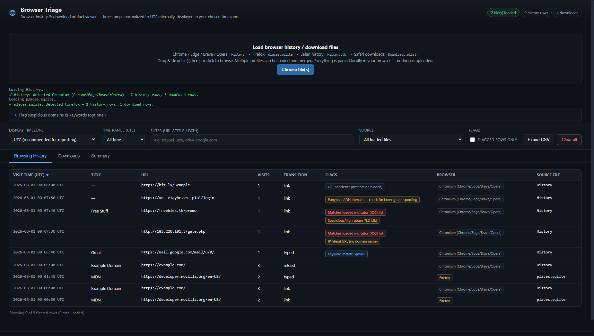
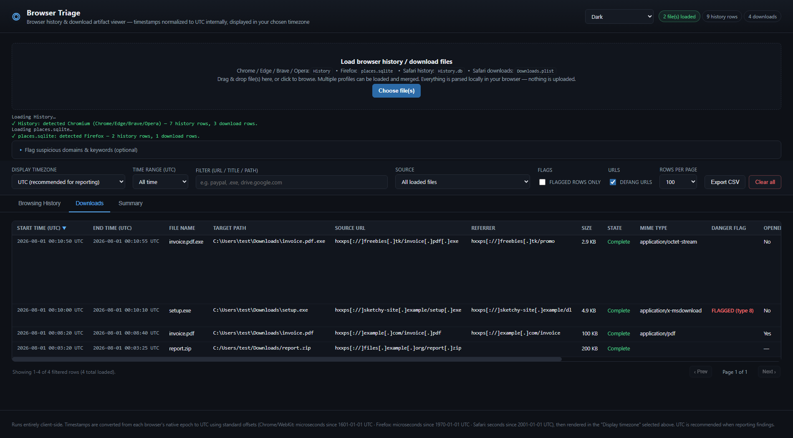

# Browser Triage


A single-page, fully client-side browser forensics tool. Load a browser's history and downloads database directly, and get a normalized, searchable, UTC-first timeline — with automatic flagging of suspicious domains and downloads. Nothing ever leaves your machine.

> **This project is fully vibe coded.** Every feature here — the SQLite/plist parsers, the heuristics, all 13 themes — was built through conversational, AI-assisted development rather than a traditional planned build. Each feature was verified along the way with real automated runs against synthetic test data (not just eyeballed), but there's no substitute for reading the code yourself before relying on it for anything that matters, forensic tooling very much included.



---

## Contents

- [Features](#features)
- [Quick start](#quick-start)
- [Test data](#test-data)
- [Using the tool](#using-the-tool)
- [Suspicious-domain flagging](#suspicious-domain-flagging)
- [How timestamps work](#how-timestamps-work)
- [Themes](#themes)
- [Pagination](#pagination)
- [Activity histogram](#activity-histogram)
- [Navigation chain viewer](#navigation-chain-viewer)
- [Search-term extraction](#search-term-extraction)
- [Bookmarks](#bookmarks)
- [URL defanging](#url-defanging)
- [What's remembered between visits](#whats-remembered-between-visits)
- [Screenshots](#screenshots)
- [Privacy & offline operation](#privacy--offline-operation)
- [Known limitations](#known-limitations)
- [Project structure](#project-structure)
- [How it's built](#how-its-built)

---

## Features

- **Multi-browser history parsing** — Chrome, Edge, Brave, Opera (all Chromium `History` files), Firefox (`places.sqlite`), and Safari (`History.db`), auto-detected from the file's schema.
- **Downloads tab** with file name, full target path, source URL, referrer, size, state, MIME type, Chrome's own danger classification, and whether the user actually opened the file afterward (Chromium only).
- **Bookmarks tab** — Chromium `Bookmarks` (JSON), Firefox (`moz_bookmarks`, from the same `places.sqlite`), and Safari `Bookmarks.plist`, each with its full folder path, run through the same flagging heuristics as History and Downloads.
- **Search-term extraction** — a "Search Term" column on the History tab parses the actual typed query out of Google/Bing/DuckDuckGo/Yandex/Baidu/and more search-result URLs, identically across all three browsers, since it works from the URL itself rather than a browser-specific schema.
- **Safari `Downloads.plist` / `Bookmarks.plist` support** — a hand-written binary/XML plist parser, since Safari downloads and bookmarks live in property lists rather than the history SQLite database.
- **UTC-first timestamps**, converted from each browser's native epoch, with a **display timezone selector** (defaults to UTC, supports the full IANA timezone list) that re-renders every timestamp — including custom range inputs and CSV exports — without changing what's stored.
- **Time range filtering** — quick presets (1h / 24h / 7d / 30d) or a custom from/to range in whatever timezone you've selected.
- **Suspicious-domain & indicator flagging** — built-in heuristics plus an optional pasted/uploaded IOC list, matched entirely offline. See [below](#suspicious-domain-flagging).
- **Search, per-file source filtering, sortable columns**, and a "flagged rows only" toggle.
- **Paginated results** — 100/250/500/1,000 rows per page, so a large history never renders (or scrolls) all at once. See [Pagination](#pagination).
- **Activity-over-time histogram** on the Summary tab — an adaptively-bucketed bar chart of history visits vs. downloads. See [Activity histogram](#activity-histogram).
- **Navigation chain viewer** — click any History URL to see the chain of pages that led to it (Chromium/Firefox only). See [Navigation chain viewer](#navigation-chain-viewer).
- **URL defanging** — URLs render as `hxxps[://]example[.]com` by default, so they're safe to paste into tickets/chat/reports. See [URL defanging](#url-defanging).
- **Summary tab** with per-file SHA-256 hashes, row counts, and earliest/latest activity — useful for chain-of-custody notes.
- **CSV export** of whatever's currently filtered and visible.
- **13 color themes** — Dark (default), Light, Claude Light/Dark, and popular palettes (Nord, Dracula, Monokai, One Dark, Gruvbox, Catppuccin Mocha, GitHub Dark, Solarized Dark/Light) — switchable from the header. See [Themes](#themes).
- **Settings and watchlists remembered between visits** (theme, timezone, page size, IOC/keyword lists) — see [What's remembered between visits](#whats-remembered-between-visits).
- No build step, no dependencies beyond one bundled library.
- **100% offline-capable** — everything, including the SQLite engine, is bundled locally. No file, hash, or URL is ever sent anywhere.

---

## Quick start

This is a static site, but it loads a WebAssembly SQLite engine, and Chromium browsers block WASM loaded from `file://` via CORS. So run a tiny local server rather than double-clicking `index.html`:

```bash
# from inside the Browser-Triage folder
python -m http.server 8000
```

Then open **http://localhost:8000/index.html**.

(Firefox doesn't have the `file://` restriction, so double-clicking `index.html` works there directly — but a local server is the reliable option across all browsers.)

No installation, no accounts, no internet connection required after the initial download of this folder.

---

## Test data

Sample files for all three browsers — history, downloads, and bookmarks, with a mix of ordinary and deliberately-flaggable content — are in [`test-data/`](test-data/) if you want to try the tool without a real profile.

---

## Using the tool

1. **Load files** — drag and drop, or click "Choose file(s)". You can load several profiles/browsers at once; they merge into one timeline, each row tagged with its source file and browser.
2. **Pick a display timezone** — defaults to UTC (recommended for reporting). Switching it re-renders every timestamp on screen and in CSV exports; the underlying data is always stored as UTC, so switching back and forth never loses precision.
3. **Filter by time** — use a quick preset or "Custom range…" to set an exact from/to window in the currently selected timezone.
4. **Search** — the filter box matches title/URL for history, and file name/path/URL for downloads.
5. **Narrow by source file** if you've loaded multiple profiles and want to isolate one.
6. **(Optional) Flag suspicious activity** — expand "Flag suspicious domains & keywords" to paste an IOC/keyword list, then click **Save for next time** if you want it to carry over to your next session (plain **Apply** only affects the current one). See [Suspicious-domain flagging](#suspicious-domain-flagging).
7. **Sort** any table by clicking its column header. **Page** through results with the Prev/Next controls below each table, and adjust rows-per-page (100/250/500/1,000) in the toolbar.
8. **Click any History URL** to see the chain of pages that led to it — see [Navigation chain viewer](#navigation-chain-viewer). URLs display defanged by default (`hxxps[://]...`); toggle **"Defang URLs"** off if you need the live form.
9. **Check the Summary tab** for per-file SHA-256 hashes, the overall earliest/latest activity, and the activity-over-time histogram — handy for a report or chain-of-custody note.
10. **Export CSV** to save whatever's currently filtered and visible on the active tab (all matching rows, not just the current page).

---

## Suspicious-domain flagging

A "Flags" column appears on both History and Downloads, populated by three layers that all run **entirely locally**:

**Built-in heuristics** (always on, no setup):
- Suspicious/high-abuse TLDs (`.tk`, `.xyz`, `.top`, `.icu`, `.zip`, etc.)
- IP-literal URLs (no domain name at all)
- Punycode/IDN domains (possible homograph spoofing, e.g. a lookalike of a real brand)
- URL shorteners (destination hidden)
- Dangerous download file types (`.exe`, `.scr`, `.ps1`, `.hta`, `.lnk`, …)
- Disguised double extensions (`invoice.pdf.exe`, `photo.jpg.scr`)

**Optional indicator (IOC) list** — expand "Flag suspicious domains & keywords" above the toolbar. In the **Domains / IPs** box, paste or upload a list of known-bad domains/IPs from whatever threat-intel source you're using for the case (one per line; full URLs, `www.`, and `#` comments are all handled). Matching is suffix-aware — an indicator for `evil.com` also catches `sub.evil.com`, but never partial lookalikes like `notevil.com`.

**Optional keyword list** — the second box, **Keywords**, does free-text substring matching against page titles, URLs, and download filenames/paths (e.g. `wire transfer`, `confidential`, a case-specific project codename). This is deliberately separate from the domain list: keyword matching is far noisier (a keyword like "invoice" will hit legitimately all the time), so keyword hits render in a distinct purple badge rather than being conflated with a real domain/IOC reputation hit.

Both lists are matched against already-loaded data in your browser; neither is ever transmitted anywhere.

Flags are color-coded by severity/type — **red** = IOC domain/IP match, **amber** = medium-confidence built-in heuristic, **grey** = low-confidence/informational heuristic, **purple** = keyword match — and stack, so a single row can carry several at once. Use the "Flagged rows only" toggle to filter down to just what's been flagged, and check the Summary tab for flagged-row counts.

**These are leads, not verdicts.** A `.tk` domain, a URL shortener, or a keyword hit isn't automatically malicious, and this tool has no live reputation lookups — sending a case's visited domains to a third-party API mid-investigation is an OPSEC problem the design deliberately avoids. Treat flags as a fast way to triage a large timeline, not as ground truth.

---

## How timestamps work

Each browser stores time in a different native epoch. Everything is converted to milliseconds since the Unix epoch (UTC) on load, then rendered in whichever display timezone is selected:

| Browser | Native format |
|---|---|
| Chrome / Edge / Brave / Opera | Microseconds since 1601-01-01 00:00:00 UTC (WebKit/Chrome time) |
| Firefox | Microseconds since 1970-01-01 00:00:00 UTC |
| Safari | Seconds since 2001-01-01 00:00:00 UTC (Core Data / Mac absolute time) |

Rendered timestamps always show their UTC offset explicitly (e.g. `2026-08-01 08:15:00 UTC-4`), so there's never ambiguity about which timezone you're looking at.

---

## Themes

A theme picker in the top-right corner switches between color themes, with the choice remembered in your browser (`localStorage`) so it's still set next time you open the tool.

**Default**
- **Dark** (default) — the original dark theme.
- **Light** — a clean, high-contrast light theme.

**Claude**
- **Claude Light** — a warm, cream-toned theme inspired by Claude.ai's look (an approximation, not an official Anthropic asset).
- **Claude Dark** — the dark companion: same warm terracotta accent, on a warm charcoal background instead of cream.

**Popular**
- **Nord** — the well-known [Nord](https://www.nordtheme.com/) arctic color palette.
- **Dracula** — the widely-used [Dracula](https://draculatheme.com/) palette.
- **Monokai** — the classic Sublime Text color scheme.
- **One Dark** — Atom's (and many VS Code themes') default dark palette.
- **Gruvbox Dark** — the popular retro-groove palette.
- **Catppuccin Mocha** — the [Catppuccin](https://catppuccin.com/) pastel dark palette.
- **GitHub Dark** — GitHub's own dark UI colors.

**Solarized**
- **Solarized Dark** / **Solarized Light** — the classic [Solarized](https://ethanschoonover.com/solarized/) palette, whose accent colors are deliberately calibrated to work on both its light and dark backgrounds.

Every color in the UI — including the severity colors on the Flags column — is driven by a small set of CSS custom properties per theme, so every theme stays internally consistent rather than just being a background/text swap. Well-known palettes (Nord, Dracula, Monokai, One Dark, Gruvbox, Catppuccin, Solarized, GitHub) use each project's official published colors.

---

## Pagination

Both History and Downloads are paginated rather than rendering the entire filtered result at once. It starts at **100 rows per page**; use the "Rows per page" dropdown to switch to 100 / 250 / 500 / 1,000. Prev/Next controls and a "Page X of Y" indicator sit below each table, alongside a "Showing 1–100 of N" summary.

Changing the search, time range, source filter, "flagged only" toggle, or sort order all reset the current page back to 1 (the result set underneath has changed, so page 3 of the old results wouldn't mean anything). Changing the page size keeps you on page 1 too. None of this affects **CSV export** — export always includes every row currently matching your filters, not just the page you're looking at.

---

## Activity histogram

The Summary tab includes a bar chart of activity over time — history visits (blue/accent) and downloads (amber), stacked per time bucket. It reflects whatever's currently filtered (search, time range, source, flagged-only), so you can visually zoom into a subset, e.g. turn on "Flagged rows only" to see when the suspicious activity actually happened.

Bucketing is adaptive: the chart picks the coarsest granularity (hour → 6 hours → day → week → month) that keeps the number of buckets at or under 60, based on the span between your earliest and latest filtered event. A few hours of activity gets hourly buckets; a few months gets weekly or monthly ones. Hover any bar for the exact counts. It's rendered as inline SVG — no charting library.

---

## Navigation chain viewer

Click any URL in the History table to see the chain of pages that led to it — e.g. *search results → redirect portal → payload.exe* — reconstructed from the browser's own referring-visit link (Chromium's `visits.from_visit`, Firefox's `moz_historyvisits.from_visit`). Each step in the popup shows its time, title, URL, and transition type (typed / link / redirect / etc.), with the page you clicked highlighted at the bottom.

This is genuinely reconstructed navigation history, not a guess — if a visit has no referrer (a typed URL, a bookmark, a new tab), the chain is just that one entry, and the tool says so rather than fabricating a path. **Not available for Safari** — `History.db` doesn't record a referring-visit chain the way Chromium and Firefox do; clicking a Safari URL says so explicitly.

URLs are still never actual hyperlinks (deliberately — see below), so clicking one only opens this chain viewer, it never navigates anywhere.

---

## Search-term extraction

A "Search Term" column on the History tab shows the literal query behind a search-result-page visit — e.g. a row for `https://www.google.com/search?q=...` shows the decoded `q=` value directly, without you having to read it out of the URL. It's parsed straight from the visited URL's host/path/query string (Google, Bing, DuckDuckGo, Yandex, Baidu, Ecosia, Startpage, Brave Search, Ask, AOL, YouTube, Amazon, and eBay are recognized), which is what makes it work identically across Chromium, Firefox, *and* Safari — Safari's `History.db` has no dedicated "typed search" table the way Chromium's `keyword_search_terms` does, but every browser's history still records the visited search-results URL, so parsing the URL itself covers all three with one code path.

The search box also matches against extracted search terms, so searching for a case-relevant term surfaces both pages that mention it *and* searches for it.

This is a fixed list of well-known search engines — a query run through an engine that isn't recognized simply won't populate the column (the row itself is unaffected either way).

---

## Bookmarks

A **Bookmarks** tab parses each browser's saved bookmarks, with title, URL, full folder path, and the same domain/keyword flagging heuristics used on History and Downloads — a bookmarked phishing page or high-abuse-TLD domain gets flagged just like a visited one would.

- **Chromium** bookmarks live in a separate `Bookmarks` file (plain JSON, not SQLite) in the same profile folder as `History` — load it alongside `History` if you want bookmarks too.
- **Firefox** bookmarks (`moz_bookmarks`) live in the same `places.sqlite` already loaded for history — no separate file needed.
- **Safari** bookmarks live in a separate `Bookmarks.plist` file, parsed with the same hand-written plist parser used for `Downloads.plist`.

Safari's `Bookmarks.plist` doesn't record a per-bookmark "date added" the way Chromium and Firefox do, so that column reads "—" for Safari bookmarks; everything else (title, URL, folder, flags) is still populated.

---

## URL defanging

Every URL shown in the tool — History rows, Downloads' Source URL and Referrer, the navigation chain viewer, and CSV export — is **defanged by default**: `https://malicious.com/link` renders as `hxxps[://]malicious[.]com/link`. This is the standard DFIR convention for handling untrusted URLs, and it matters here specifically because:

- It can't be auto-linkified or accidentally clicked, in this tool or after you paste it elsewhere.
- It's safe to drop straight into a ticket, chat message, or report without a security scanner or email gateway treating it as a live IOC.
- It's exactly why URLs in this tool were never made into real clickable `<a href>` links in the first place — the defang toggle is a continuation of that same reasoning, not a separate feature bolted on.

Toggle it off with the **"Defang URLs"** checkbox in the toolbar if you need the live form (e.g. deliberately visiting a URL yourself, elsewhere, with appropriate precautions). The underlying data — sorting, IOC/keyword matching, everything — always operates on the real URL regardless of what's displayed; defanging is a rendering-only transform.

---

## What's remembered between visits

The following are saved in your browser (`localStorage`) so they carry over next time you open the tool:

- Selected **theme**
- Selected **display timezone**
- Selected **rows-per-page**
- The **"Defang URLs"** toggle state
- The **domain/IP indicator list** and **keyword list** text — but only once you click **"Save for next time"** next to Apply. Clicking **Apply** alone only affects the current session; it does *not* persist. This is deliberate: applying a one-off list for the case you're looking at right now shouldn't silently become tomorrow's default. Clicking a list's **Clear** button also erases its saved copy.

**Deliberately not saved:** any loaded browser history/downloads data, and the current search text, time range, source filter, "flagged only" state, or sort order. Every session starts from a clean slate for the actual case data — a forensics tool shouldn't be the thing that leaves a case's browsing history sitting around in its own local storage after you close the tab. Only your tool preferences and explicitly-saved watchlists persist.

---

## Screenshots

**Downloads, with file state, danger classification, and source/referrer URLs:**



---

## Privacy & offline operation

- All parsing — SQLite (via a locally bundled WebAssembly build of SQLite), the custom plist parser, timestamp conversion, and indicator matching — happens in your browser tab.
- No network requests are made once the page and its bundled `vendor/sql-wasm.wasm` are loaded — you can disconnect from the internet entirely and it keeps working.
- No file, hash, URL, or indicator you load or paste is ever transmitted anywhere. There is no backend.
- Per-file SHA-256 hashes are computed client-side for reference (e.g. for a chain-of-custody note), not sent anywhere.

---

## Known limitations

- **Firefox downloads** are read from the `moz_annotations` scheme Firefox has used since ~v26. Very old or unusual profiles may not have this data; the tool will say so rather than fail silently.
- **Safari downloads** require the separate `Downloads.plist` file — `History.db` alone only yields browsing history. Key names in `Downloads.plist` have shifted slightly across macOS/Safari versions; the parser checks the common variants but an unusual version may yield partial fields.
- **Locked database files**: if the source browser is still running, its history file may be locked by the OS and fail to load. Close the browser (or work from a copy) first.
- No hard cap on dataset size — tables are paginated (see [Pagination](#pagination)) rather than truncated. That said, search, sorting, and flag matching all run over the *full* filtered dataset in memory on every change (not just the current page), so a very large profile (100k+ rows) may feel a beat slower per keystroke/click than a small one.
- The navigation chain viewer only works for Chromium and Firefox — Safari's `History.db` doesn't record a referring-visit chain (see [Navigation chain viewer](#navigation-chain-viewer)).
- **Chromium bookmarks** require the separate `Bookmarks` JSON file — `History` alone only yields browsing history and downloads (see [Bookmarks](#bookmarks)).
- **Safari bookmarks** require the separate `Bookmarks.plist` file, and don't include a per-bookmark date-added timestamp (see [Bookmarks](#bookmarks)).
- **Search-term extraction** recognizes a fixed list of well-known search engines by URL pattern — a query run through an engine not on that list simply won't populate the Search Term column (see [Search-term extraction](#search-term-extraction)).
- Heuristic flags are intentionally simple, local, pattern-based checks — not a substitute for actual threat intelligence or reputation services.

---

## Project structure

```
Browser-Triage/
├── index.html          Page structure & UI
├── style.css            Styling & all 13 color themes (CSS custom properties)
├── app.js                All parsing, heuristics, filtering, and rendering logic
├── vendor/
│   ├── sql-wasm.js       sql.js (SQLite compiled to WebAssembly)
│   └── sql-wasm.wasm
├── docs/                  Screenshots used in this README
└── test-data/             Synthetic sample files (all browsers) — see test-data/README.md
```

## How it's built

- **[sql.js](https://sql.js.org/)** (SQLite compiled to WebAssembly) is bundled locally in `vendor/` so the tool works fully offline — no CDN dependency.
- The **binary and XML plist parser** for Safari's `Downloads.plist` is hand-written from the Apple bplist format spec — no external plist library exists for the browser, so this was implemented from scratch in `app.js`.
- No framework, no build step, no package manager. Three files (`index.html`, `style.css`, `app.js`) plus one bundled dependency.
